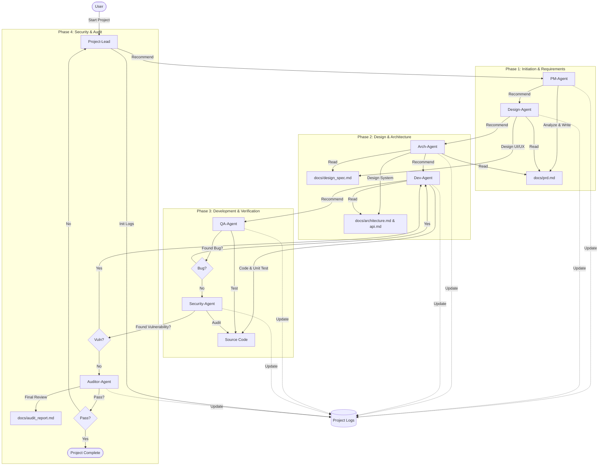

# Agent 团队协作工作流指南

本文档系统性地描述了 `Object Agent` 团队中各个智能体（Agent）如何协同工作，以完成复杂的软件开发任务。

## 1. 核心协作理念

### 1.1 文档驱动 (Document-Driven)
团队协作的基础是**文档**。每一个环节的产出物（Artifact）都是下一个环节的输入。Agent 之间不通过口头指令传递复杂信息，而是通过标准化的文档（如 PRD、架构图、API 规范）进行交接。

### 1.2 状态透明 (State Transparency)
为了确保所有 Agent 对项目进度有统一的认知，我们引入了**项目日志管理机制**。
- **全局进度表**: `.project_log/project_status.md` 是项目的“仪表盘”。
- **工作闭环**:
    - **工作前**: 任何 Agent 在开始任务前，必须查阅全局进度表。
    - **工作后**: 任何 Agent 完成任务后，必须更新自己的工作日志（如 `PM_Agent_log.md`）并同步全局进度表。

### 1.3 人机协同 (Human-in-the-Loop)
**Project-Lead (项目负责人)** 作为总调度，始终与用户保持沟通。在每个关键节点，Agent 都会主动建议用户调用下一个角色的 Agent，但最终的调用决定权在用户手中。

---

## 2. 团队角色概览

| 角色 (Agent) | 职责简述 | 上游 (Input From) | 下游 (Output To) |
| :--- | :--- | :--- | :--- |
| **Project-Lead** | 项目总控、进度管理、日志初始化 | 用户 (User) | PM (产品经理) |
| **PM-Agent** | 需求分析、PRD 撰写 | Project-Lead / 用户 | Design (设计师) |
| **Design-Agent** | UI/UX 设计、界面规范 | PM (PRD) | Arch (系统架构师) |
| **Arch-Agent** | 系统架构、API 定义、数据库设计 | Design / PM | Dev (全栈开发) |
| **Dev-Agent** | 代码实现、单元测试 | Arch (架构/API) | QA (测试工程师) |
| **QA-Agent** | 功能测试、Bug 报告、测试咨询 | Dev (代码) | Security (安全工程师) |
| **Security-Agent** | 安全审计、漏洞扫描 | QA (测试报告) | Auditor (项目监理) |
| **Auditor-Agent** | 最终验收、评分、改进建议 | Security / 全局文档 | Project-Lead / 用户 |

---

## 3. 标准作业流程 (Standard Operating Procedure)

以下是项目从 0 到 1 的完整流转链路图：



### 阶段一：立项与需求 (Initiation & Requirements)

1.  **项目启动**:
    - **执行者**: `Project-Lead`
    - **动作**: 响应用户意图，初始化 `.project_log` 目录和 `project_status.md` 文件。
    - **流转**: 建议调用 **产品经理**。

2.  **需求定义**:
    - **执行者**: `PM-Agent`
    - **动作**: 分析用户需求，编写 `docs/prd.md`。
    - **日志**: 更新 `PM_Agent_log.md`。
    - **流转**: 建议调用 **设计师**。

### 阶段二：设计与架构 (Design & Architecture)

3.  **界面设计**:
    - **执行者**: `Design-Agent`
    - **动作**: 基于 PRD，产出 `docs/design_spec.md` (UI/UX 规范)。
    - **日志**: 更新 `Design_Agent_log.md`。
    - **流转**: 建议调用 **系统架构师**。

4.  **架构蓝图**:
    - **执行者**: `Arch-Agent`
    - **动作**: 基于 PRD 和设计规范，产出 `docs/architecture.md` (架构图) 和 `docs/api.md` (接口定义)。
    - **日志**: 更新 `Arch_Agent_log.md`。
    - **流转**: 建议调用 **全栈开发专家**。

### 阶段三：开发与验证 (Development & Verification)

5.  **代码实现**:
    - **执行者**: `Dev-Agent`
    - **动作**: 编写业务代码，执行单元测试，确保符合 API 契约。
    - **日志**: 更新 `Dev_Agent_log.md`。
    - **流转**: 建议调用 **测试工程师**。

6.  **测试保障**:
    - **执行者**: `QA-Agent`
    - **动作**: 编写 `docs/test_plan.md`，执行自动化测试，提交 Bug 报告。若有 Bug，回退给 Dev；若通过，继续。
    - **日志**: 更新 `QA_Agent_log.md`。
    - **流转**: 建议调用 **安全工程师**。

### 阶段四：安全与验收 (Security & Audit)

7.  **安全审计**:
    - **执行者**: `Security-Agent`
    - **动作**: 进行代码审计和漏洞扫描，产出 `docs/security_audit.md`。
    - **日志**: 更新 `Security_Agent_log.md`。
    - **流转**: 建议调用 **项目监理**。

8.  **最终验收**:
    - **执行者**: `Auditor-Agent`
    - **动作**: 对整个项目（文档、代码、功能、安全）进行综合打分，产出 `docs/audit_report.md`。
    - **日志**: 更新 `Auditor_Agent_log.md`。
    - **流转**: 
        - **满分通过**: 项目结束。
        - **存在问题**: 建议联系 **项目负责人** 进行整改协调。

---

## 4. 异常处理流程

在协作过程中，难免遇到问题。以下是逆向流转（打回）的规则：

*   **QA 发现 Bug**: QA -> Dev (修复) -> QA (回归测试)。
*   **Security 发现漏洞**: Security -> Dev (修复) -> QA (回归) -> Security (复测)。
*   **架构无法实现需求**: Arch -> PM (修改 PRD) -> Arch (重新设计)。
*   **验收不合格**: Auditor -> Project-Lead (分配修复任务) -> 相关 Agent。

## 5. 目录结构规范

为了支持上述协作，项目根目录应保持以下结构：

```
Project_Root/
├── .project_log/           # [核心] 项目日志目录
│   ├── project_status.md   # 全局项目进度表
│   ├── PM_Agent_log.md     # 各 Agent 工作日志
│   ├── Dev_Agent_log.md
│   └── ...
├── docs/                   # [核心] 文档产出目录
│   ├── prd.md              # 产品需求文档
│   ├── design_spec.md      # 设计规范
│   ├── architecture.md     # 架构文档
│   ├── api.md              # API 接口文档
│   ├── test_plan.md        # 测试计划
│   ├── security_audit.md   # 安全审计报告
│   └── audit_report.md     # 验收报告
├── src/                    # 源代码目录
├── tests/                  # 测试代码目录
└── ...
```

---

**注意**: 所有 Agent 在推荐下一个角色时，必须使用**中文简体**名称（如“产品经理”、“系统架构师”），以保持用户体验的一致性。
